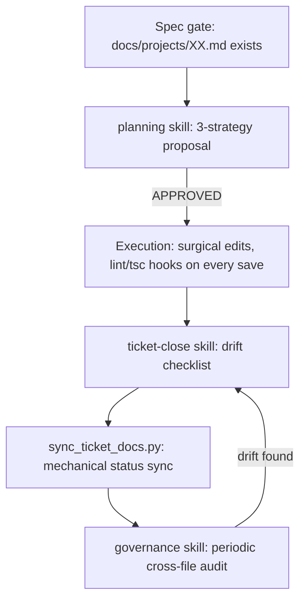

# 🏛️ MRT Governance Process

> [!NOTE]
> This document describes **how governance actually works** in My Recovery
> Toolkit — the file hierarchy, the lifecycle a piece of work moves through,
> and the AI skills/hooks that keep the paper trail honest. It complements
> [`DEVELOPER_GUIDE.md`](./DEVELOPER_GUIDE.md) (which owns the *prompt
> templates* for the Recursive Build Protocol) by focusing on the governance
> *system* itself — who/what checks what, and when.

---

## 1. Why governance is a separate concern from code review

MRT treats "is the code correct" and "do our records match reality" as two
different failure modes that need two different checks. A feature can be
perfectly implemented and still leave the project in a worse state if:

- its spec file is never updated to match an approved mid-build deviation,
- its Firestore collection never makes it into `firestore.rules`,
- its status says `🟢 Done` in one file and `⚪ Planned` in another,
- it changes user-facing behavior that never reaches the changelog, or
- a report's findings get fixed in code but the report itself is never
  reconciled, so the next reader re-discovers the same "problem."

Every governance file and skill below exists to catch one of these specific
failure modes. None of them review code quality — that's lint, `tsc`,
Vitest, and the `fix`/`review`/`zk-audit` skills' job.

---

## 2. The governance file hierarchy

```
docs/
  ROADMAP.md              # The 4 Waves — long-horizon plan, one row per project
  BACKLOG.md               # Approved-but-deferred ideas, tagged by persona; also
                            # "parked" specs and infra triggers with no Wave yet
  ACTIVE_CYCLE.md          # This sprint only — Triage, Active, Paused, Chores,
                            # and "Resolved This Cycle"
  SCHEMA_ARCHITECTURE.md   # Data dictionary — every Firestore field, type,
                            # encryption status
  PERSONAS.md              # User-facing personas (David/Ned/Lisa/Walt/Maya/Jordan)
  governance/
    DEVELOPER_GUIDE.md       # Recursive Build Protocol + Maintenance Protocols
    INTERNAL_PERSONAS.md     # Internal stakeholder personas (Alex/Dev/Morgan/Taylor)
    GOVERNANCE_PROCESS.md    # This file
  projects/
    00_TEMPLATE.md          # Required shape for every spec (enforced in CI)
    XX_FEATURE_NAME.md       # One file per project, numbered PROJ-XX
    archive/                 # Superseded specs — each needs a "Superseded by" pointer
  reports/                  # One-off investigation reports (audits, reviews)
    archive/                 # Reports whose findings are now fully covered elsewhere
docs-site/support/changelog.md   # Public, plain-language, user-facing only
scripts/sync_ticket_docs.py      # The one mechanical sync point across all of the above
```

**Status vocabulary**, used identically across every file so it's
grep-able and auditable: `⚪ Planned`, `🟡 Active / Queued`, `🟢 Done`,
`⏸️ Paused`, `⛔ Blocked`, `[x] COMPLETED`.

**The hard gate:** no feature work begins without a spec file
(`docs/projects/XX_FEATURE.md`, built from `00_TEMPLATE.md`) existing first.
This is stated in `CLAUDE.md` as a `[!IMPORTANT]` callout and enforced again by
the `planning` skill's gatekeeper check — deliberately redundant, since it's
the one rule that upstream-gates everything else in this document.

`npm run docs:check-specs` runs `00_TEMPLATE.md`'s required-sections check
against every spec in CI, so a spec missing a Status/Persona/Objective/QA
section fails the build mechanically, not just on the next manual audit.

---

## 3. The lifecycle of a piece of work



1. **Spec exists first.** No planning or code without `docs/projects/XX_FEATURE.md`.
2. **`planning` skill** (Recursive Build Protocol Phase 2) produces a
   dependency-impact table, three scored strategies, a ZK/security analysis,
   and a test contract — then stops and waits for an explicit `APPROVED`.
3. **Execution** happens under the Phase 3 rules (surgical edits, strict
   typing, fail-safes) with `PostToolUse` hooks auto-running ESLint and
   `tsc --noEmit` on every `Edit`/`Write` so drift is caught within the same
   turn.
4. **`ticket-close` skill** runs the drift checklist (schema, spec, user
   guide, tech debt, ZK boundary — see §5) and drafts the plain-language
   public-changelog note if the change is user-visible.
5. **`scripts/sync_ticket_docs.py`** applies the mechanical parts of that
   checklist's output in one pass — spec Status flip, `ACTIVE_CYCLE.md`
   "Resolved This Cycle" line, `ROADMAP.md` "Recently Shipped" line, and
   (only when `--public-note` is explicitly passed) a changelog entry. It
   defaults to a dry run; `--apply` is required to write. It refuses to run
   if `--public-note` looks like it contains a ticket ID or file path — a
   mechanical backstop for the rule in step 4, not a substitute for judgment.
6. **`governance` skill** runs periodically (before sprint planning, after a
   sprint close) as the cross-file auditor of last resort — it re-derives
   the whole project registry from every governance file plus targeted
   codebase evidence, and reports every disagreement it finds, including
   ones steps 1-5 should have already prevented. Its findings feed back into
   another `ticket-close`-style fix pass.

---

## 4. The Maintenance Protocols (scheduled, not per-ticket)

Three "shadow processes," each with its own cadence and its own skill,
that run independently of any single ticket:

| Protocol | Cadence | Skill | Catches |
|---|---|---|---|
| **A — Schema Sync** | Weekly, or after any Firestore model change | *(manual — audit `src/lib/db.ts` against `SCHEMA_ARCHITECTURE.md`)* | Undocumented fields, missing encryption-status notes |
| **B — Debt Ledger** | Bi-weekly | `debt-ledger` | `TODO`/`FIXME`/`HACK`, `any` usage, `eslint-disable`, `@ts-ignore` accumulating silently |
| **C — Release Scribe** | Before every merge to `main` | `release-scribe` | User-visible work that shipped without a changelog entry |

Protocol A doesn't have a dedicated skill yet — it's currently a manual
`grep`-and-compare pass. If it starts getting skipped, that's the next
skill worth writing (see the `debt-ledger` skill's shape as a template).

---

## 5. AI skills that enforce governance

All skills live at `.claude/skills/<name>/SKILL.md`. The ones relevant to
governance specifically (as opposed to code quality/design/security, which
have their own skills too) are:

### `governance` — the cross-file auditor
The centerpiece. **Read-and-report only — never edits a file itself.**

1. Ingests all four governance files plus every spec in `docs/projects/` in
   full (fails loud if anything's missing, rather than auditing partial data).
2. Runs four **narrow, targeted** codebase evidence checks per claimed
   `Done`/`Active` project — route existence, dedicated hook existence,
   page/component existence, Firestore-rules coverage — deliberately *not*
   a full codebase read (context-budget reasons). Classifies each project
   `✅ VERIFIED` (≥2/4 pass) / `⚠️ PARTIAL` (1/4) / `❌ UNVERIFIED` (0/4) /
   `⏭️ SKIPPED` (not claimed shipped).
3. Builds a project registry (every status field from every source file,
   even when they conflict) and runs ten lettered checks against it:

   | Check | Catches |
   |---|---|
   | A — Status Consistency | Roadmap/Active-Cycle/spec disagree on status |
   | B — Orphan Projects | In one file, missing from another |
   | C — Persona Mismatches | Persona name not in the canonical list |
   | D — Completed Not Archived | Done work missing from "Recently Shipped" |
   | E — Wave Alignment | Later-wave work active in an earlier sprint |
   | F — Spec Quality | Missing required template sections |
   | G — Backlog Completeness | No status note, or already-shipped item still listed |
   | H — Blocked Items | No stated blocker reason |
   | **I — Code vs. Governance** | **"False Done" (0/4 evidence, claims shipped) — the most important check; "Undocumented shipping"; Firestore-rules security gaps; partial builds marked Done** |
   | J — Stale Reports & Archive Hygiene | Reports whose findings are fully absorbed elsewhere but not archived; archived specs missing a "Superseded by" pointer; broken path citations |

4. Reports in a fixed severity order (Critical → Medium → Quality → Clean →
   summary counts → top-5 fix order) and ends with an explicit gate: it
   never applies a fix itself, only offers to on `APPLY ALL`, and even then
   routes through `sync_governance.py` with a dry run first.

### `ticket-close` — per-ticket drift + sync
Run at the end of every ticket. Six checks, in order:
0. **User-visible classification, done first, from what the ticket actually
   did — never from its internal label.** (A retroactive scrub found several
   tickets tagged "(Internal)" that were real user-facing fixes.) Drafts the
   plain-language public note here for review, and has one hard rule with no
   exceptions: a security incident or credential rotation never gets a
   changelog note, softened or otherwise.
1. Schema drift (`SCHEMA_ARCHITECTURE.md` vs. `src/lib/db.ts`)
2. Spec drift (`docs/specs/` vs. implemented logic)
3. **User-guide drift — blocking, not advisory, whenever new user-facing
   UI/behavior shipped.** Requires actually reading the guide pages, not
   inferring coverage.
4. Feature-spec drift (approved deviations folded back into the spec)
5. Tech debt scan of touched files
6. ZK/security-boundary check on every new write

Outputs a table with 🔴 NEEDS FIX / 🟡 ADVISORY / ✅ Clean per check, and
won't call a ticket closed while any 🔴 remains open.

### `release-scribe` — pre-`main` changelog gap sweep
A second, coarser-grained check than `ticket-close`'s per-ticket Check 0 —
diffs *everything* resolved since the changelog's last entry against what's
actually in it, catching anything that slipped through individual ticket
closes. Same user-visible classification rule, same hard "never for
security incidents" exception, same "route through the sync script, don't
hand-edit" rule.

### `debt-ledger` — bi-weekly tech-debt sweep (Protocol B)
Greps for the four debt signatures repo-wide, filters known-acceptable
noise (test fixtures, the one project-sanctioned `eslint-disable`), and
proposes new `ACTIVE_CYCLE.md` "Chores & Tech Debt" entries as a diff —
never edits the file without approval, since it's a shared doc.

### `planning` — the spec-gated Phase 2 skill
Refuses to run without a spec file existing. This is the point where
governance intersects with the code itself: no spec, no plan, no code — full
stop.

### `review` — the self-correction loop
Run after a feature or bug-fix session. Checks whether `CLAUDE.md` itself
drifted from what was actually true this session, whether any invoked skill
gave stale or wrong guidance, and what rule — if it had existed — would have
prevented whatever just got fixed. This is the mechanism that keeps the
whole governance system from calcifying: every other skill enforces
*existing* rules; this one proposes new ones from lived experience.

### `zk-audit` and `deps-audit`
Not governance-file auditors in the same sense, but both feed governance:
`zk-audit`'s per-write ENCRYPTED/PLAINTEXT-OK/VIOLATION-RISK table is exactly
what `governance` Check I's "security gap" detection and `ticket-close`
Check 6 rely on having been done correctly upstream; `deps-audit`'s
critical/high-in-production threshold is the same blocker bar CI enforces.

### `secrets-scan` (skill) + the `PreToolUse` hook
Two layers: the **hook** (`.claude/hooks/secrets-scan.sh`) automatically
denies any `git commit` (run through Claude's Bash tool) whose staged diff
trips a secret-shaped pattern — private keys, cloud-provider token shapes,
JWT-shaped strings, hardcoded credential assignments. The **skill** is the
manual, broader sweep (whole tree or history range) for one-off checks like
a new clone or pre-release audit — and explicitly refuses to attempt history
remediation (`git filter-repo` + force-push + rotation) without direct user
approval, since that's the same destructive, high-blast-radius operation
`PROJ-67`'s real keystore-leak incident required.

---

## 6. The mechanical layer: `scripts/sync_ticket_docs.py`

This script exists specifically so governance updates are **templated code,
diffable in review, and re-runnable** — not a fresh one-off Python script
hand-generated by the AI for every ticket (which is what happened before
`PROJ-69`). It automates exactly the parts that are pure text templating:

- `docs/projects/<ID>_*.md` → flips the `Status` field
- `docs/ACTIVE_CYCLE.md` → appends a "Resolved This Cycle" line
- `docs/ROADMAP.md` → appends a "Recently Shipped" line
- `docs-site/support/changelog.md` → appends a version entry, **only** when
  `--public-note` is explicitly passed

It deliberately does **not** automate: whether a ticket is user-visible at
all, the wording of the public note, user-guide drift, or the tech-debt/ZK
checks — those stay in the `ticket-close` skill because they need judgment,
not templating. `--summary` (internal) and `--public-note` (external) are
kept on separate parameters on purpose, and the script hard-refuses to run
if a `--public-note` looks like it leaked a ticket ID or file path — a
mechanical backstop for the leak `PROJ-69` was created to close.

Defaults to a dry run; `--apply` is required to write.

---

## 7. Enforcement that doesn't rely on the model remembering

Some rules are too easy to forget under context pressure, so they're
enforced by `.claude/settings.json` hooks instead of prose:

| Hook | Trigger | Effect |
|---|---|---|
| `secrets-scan.sh` | `PreToolUse` on `Bash`, filtered to `git commit` | Denies the commit with a structured reason if the staged diff matches a secret pattern |
| ESLint `--fix` | `PostToolUse` on `Edit`\|`Write` | Auto-fixes lint on every file touched |
| `tsc --noEmit` | `PostToolUse` on `Edit`\|`Write` (async) | Surfaces type errors within the same turn |

The permission allowlist itself is also a governance control: it's scoped to
read-only tools plus a narrow set of safe Bash subcommands (`npm run dev/test/
lint`, `git status/diff/log/add/commit`) — never a blanket allow, so anything
destructive (force-push, `reset --hard`, deploy) still requires an explicit
human approval in the moment.

---

## 8. Personas as a governance input, not just a UX input

Persona correctness is itself an audited field (`governance` skill Check C),
which is why there are two separate, both-canonical persona documents:

- **`docs/PERSONAS.md`** — David, Ned, Lisa, Walt, Maya, Jordan. Valid for any
  user-facing spec's `Primary Persona` field, plus the literal value `All`.
- **`docs/governance/INTERNAL_PERSONAS.md`** — Alex (CEO/Product), Dev/AI
  Partner, Morgan (Growth), Taylor (Support). Valid for internal/
  infrastructure specs, plus a generic `Internal` fallback when no single
  stakeholder fits.

A persona name that isn't in one of these two closed lists is a Check C
violation — this is what stops persona tagging from drifting into ad hoc
free text over time.

---

## 9. What "good" looks like — a worked example from this repo

`PROJ-69` (Changelog Split — Public/Internal Separation) is a good reference
case for how the whole system is supposed to close a real gap it found in
itself: a governance audit discovered two live security disclosures and five
mislabeled entries in the public changelog. The fix wasn't just editing the
changelog — it added the leak-guarded `--public-note`/`--version` path to
`sync_ticket_docs.py` *and* added Check 0 to the `ticket-close` skill, so the
same category of leak becomes mechanically harder to reintroduce, not just
corrected once. `docs/ACTIVE_CYCLE.md`'s "Resolved This Cycle" log and
`docs/ROADMAP.md`'s "Recently Shipped" section are full of similar
examples — most maintenance entries in this repo's history describe both a
fix *and* a change to the process that let the fix be found, which is the
behavior this whole document is trying to make repeatable.

---

*My Recovery Toolkit · docs/governance/GOVERNANCE_PROCESS.md*
